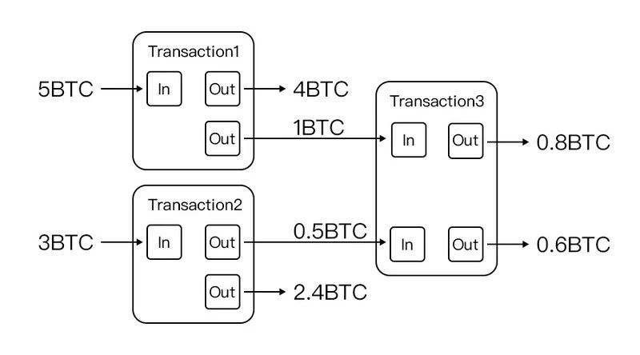

# UTXO模型与账户模型

在当前区块链世界中，主要有两种记录保存方式，UTXO 模式（Unspent Transaction Output) 和 Account （账户）模式。Bitcoin 采用的是 UTXO 模型，Ethereum 采用的 Account 模型，同样 CITA 也采用了 Account 模型。

Bitcoin 的设计初衷是点对点的电子现金系统，在比特币中，每个交易消耗之前交易生成的 UTXO 然后生成新的 UTXO，账户的余额即所有属于该地址的未花费 UTXO 集合，Bitcoin 的全局状态即当前所有未花费的 UTXO 集合。Ethereum 意图创建一个更为通用的协议，该协议支持图灵完备的编程语言，在此协议上用户可以编写智能合约，创建各种去中心化的应用。由于 UTXO 模型在状态保存以及可编程性方面的缺陷，Ethereum 引入了 Account 模型。下面对两种模型的优缺点做进一步展开。

## UTXO 模型

UTXO 模型中，交易只是代表了 UTXO 集合的变更。而账户和余额的概念是在 UTXO 集合上更高的抽象，账号和余额的概念只存在于钱包中。

**优点：**
计算是在链外的，交易本身既是结果也是证明。节点只做验证即可，不需要对交易进行额外的计算，也没有额外的状态存储。交易本身的输出 UTXO 的计算是在钱包完成的，这样交易的计算负担完全由钱包来承担，一定程度上减少了链的负担。
除 Coinbase 交易外，交易的 Input 始终是链接在某个 UTXO 后面。交易无法被重放，并且交易的先后顺序和依赖关系容易被验证，交易是否被消费也容易被举证。
UTXO 模型是无状态的，更容易并发处理。
对于 P2SH 类型的交易，具有更好的隐私性。交易中的 Input 是互不相关联的，可以使用 CoinJoin 这样的技术，来增加一定的隐私性。

**缺点：**
无法实现一些比较复杂的逻辑，可编程性差。对于复杂逻辑，或者需要状态保存的合约，实现难度大，且状态空间利用率比较低。
当 Input 较多时，见证脚本也会增多。而签名本身是比较消耗 CPU 和存储空间的。

## Account 模型

对于 Account 模型，Account 模型保存了世界状态，链的状态一般在区块中以 StateRoot 和 ReceiptRoot 等形式进行共识。交易只是事件本身，不包含结果，交易的共识和状态的共识本质上可以隔离的。

**优点：**
合约以代码形式保存在 Account 中，并且 Account 拥有自身状态。这种模型具有更好的可编程性，容易开发人员理解，场景更广泛。
批量交易的成本较低。设想矿池向矿工支付手续费，UTXO 中因为每个 Input 和 Out 都需要单独 Witness script 或者 Locking script，交易本身会非常大，签名验证和交易存储都需要消耗链上宝贵的资源。而 Account 模型可以通过合约的方式极大的降低成本。

**缺点：**
Account 模型交易之间没有依赖性，需要解决重放问题。
对于实现闪电网络/雷电网络，Plasma 等，用户举证需要更复杂的 Proof 证明机制，子链向主链进行状态迁移需要更复杂的协议。

## UTXO VS Account
对于以上几个优点和缺点，我们再做一些分析和对比。

**第一，关于计算的问题的。**

UTXO 交易本身对于区块链并没有复杂的计算，这样简单的讲其实并不完全准确，原因分有两个，一是 Bitcoin 本身的交易多为 P2SH，且 Witness script 是非图灵完备的，不存在循环语句。而对于 Account 模型，例如 Ethereum，由于计算多在链上，且为图灵完备，一般计算较为复杂，同时合约安全性就容易成为一个比较大的问题。当然是否图灵完备对于是否是账户模型并没有直接关联。但是账户模型引入之后，合约可以作为一个不受任何人控制的独立实体存在，这一点意义重大。

**第二，关于 UTXO 更易并发的问题。**

在 UTXO 模型中，世界状态即为 UTXO 的集合，节点为了更快的验证交易，需要在内存中存储所有的 UTXO 的索引，因此 UTXO 是非常昂贵的。对于长期不消费的 UTXO，会一直占用节点的内存。所以对于此种模型，理论上应该鼓励用户减少生产 UTXO，多消耗 UTXO。但是如果要使用 UTXO 进行并行交易则需要更多的 UTXO 作为输入，同时要产生更多的 UTXO 来保证并发性，这本质上是对网络进行了粉尘攻击。并且由于交易是在钱包内构造，所以需要钱包更复杂的设计。反观 Account 模型，每个账户可以看成是单独的互不影响的状态机，账户之间通过消息进行通信。所以理论上用户发起多笔交易时，当这些交易之间不会互相调用同一 Account 时，交易是完全可以并发执行的。

**第三，关于 Account 模型的交易重放问题。**

Ethereum 使用了在 Account 中增加 nonce 的方式，每笔交易对应一个 nonce，nonce 每次递增。这种方式虽然意在解决重放的问题，但是同时引入了顺序性问题，同时使得交易无法并行。例如在 Ethereum中，用户发送多笔交易，如果第一笔交易打包失败，将引起后续多笔交易都打包不成功。在 CITA 中我们使用了随机 nonce 的方案，这样用户的交易之间没有顺序性依赖，不会引起串联性失败，同时使得交易有并行处理的可能。

**第四，存储问题。因为 UTXO 模型中，只能在交易中保存状态。**

而 Account 模型的状态是在节点保存，在 Ethereum 中使用MPT 的方式存储，Block 中只需要共识 StateRoot 等即可。这样对于链上数据，Account 模型实际更小，网络传输的量更小，同时状态在节点本地使用 MPT 方式保存，在空间使用上也更有效率。例如 A 向 B 转账，如果在 UTXO 中假设存在 2 个 Input 和2个 Output，则需要 2 个 Witness script 和 2 个Locking script；在 Account 模型中则只需要一个签名，交易内容只包含金额即可。在最新的隔离见证实现后，Bitcoin的交易数据量也大大减少，但是实际上对于验证节点和全节点仍然需要针对 Witness script 进行传输和验证。

**第五，对于轻节点获取某一地址状态，UTXO 更复杂。**

例如钱包中，需要向全节点请求所有关于某个地址的所有 UTXO，全节点可以发送部分 UTXO，钱包要验证该笔 UTXO 是否已经被消费，有一定的难度，而且钱包很难去证明 UTXO 是全集而不是部分集合。而对于 Account 模型则简单很多，根据地址找到 State 中对应状态，当前状态的 State Proof 则可以证明合约数据的真伪。当然对于 UTXO 也可以在每个区块中对 UTXO 的 root 进行验证，这一点与当前 Bitcoin 的实现有关，并非 UTXO 的特点。

## 结论
综上来看，Account 模型在可编程性，灵活性等方面更有优势；chain33也正是基于这个原因，选择跟采用account模型，这也是市面上绝大多公链项目采用的。当然在简单业务和跨链上，UTXO 有其非常独到和开创性的优点。
