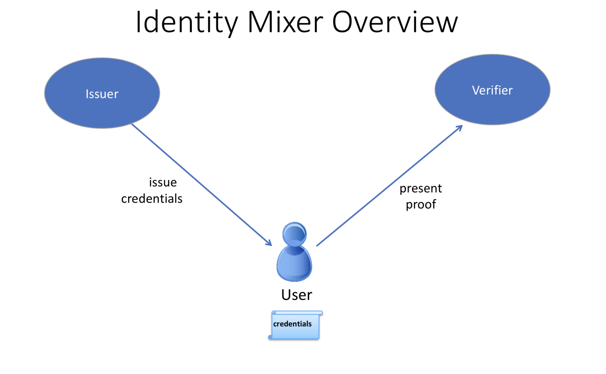

# frabic中零知识证明的应用

## 前言

Fabric 1.3中的新增的idemixer(Identity Mixer)说是采用了zero-knowledge proof(零知识证明)黑科技，零知识证明是什么东西。

## 零知识入门

这里用frabic官方给的例子。 假设Alice需要向Bob(门店职员)证明她DMV(车管所)颁发的合法驾照。这个场景,Alice就是下图的user/用户, DMV车管所则是issuer/证书颁发者, Bob则是verifier验证者。

  - 发布者以数字证书的形式发布一组用户属性，以下称此证书为“凭证（credential）”。
  
  - 用户随后会生成一个 “零知识证明” 来证明自己拥有这个凭证，并且只选择性的公开自己想公开的属性。这个证明，因为是零知识的，所以不会向验证者、发布者或任何人 透露任何额外信息。

Alice为了证明自己是合法的司机,大多时候她会把自己的驾照交给Bob检查和验证，但这样做Bob就可以知道Alice的很多额外的隐私信息,例如名字,地址,年龄等。

如果使用idemixer和零正式证明的方式, 我们只允许Bob知道当前这个女用户是个合法的司机,其它信息都保密。 即使下次Alice再来门店,Alice应该提供给Bob不同的证明,保证Bob不会知道这个证明是同一个用户。

即零知识证明可提供匿名性和无关联性。

零知识证明的益处：

- 数据隐私保护和身份验证,如上面Alice和Bob的例子所示
- 减少计算和扩容,同样的多次计算可以使用零知识证明压缩和减少,最新的以太坊可是大力推崇

## frabic中idemix

具体可以参考官方文档 https://hyperledger-fabric-cn.readthedocs.io/zh/latest/idemix.html#id2

这里不做过多的讨论，重点关注一下验证者如何验证这个环节

### 凭证的签发

**凭证签发是用户和签发者之间的一种交互协议**

发布方将其密钥和公钥以及用户属性值作为输入，
用户将发布方公钥和用户密钥作为输入

发布协议包括以下步骤:

1)发布方随机发送一个nonce给用户

2)用户使用发布方的公钥、用户密钥和nonce作为输入创建凭据请求
  该请求由对用户机密的承诺(可视为公钥)和用户密钥的零知识证明组成
  用户向发布方发送凭据请求
  
3)发布方通过验证零知识证明来验证用户的凭证请求
 如果请求是有效的，则签署对密钥的承诺向用户颁发凭据，连同属性值一起返回给用户  
 
4)用户验证发布方的签名并存储由签名值、用于创建签名的随机性、用户秘密和属性值组成的凭据 
## 验证

## 安全讨论

[参考资料](https://hyperledger-fabric-cn.readthedocs.io/zh/latest/idemix.html)

