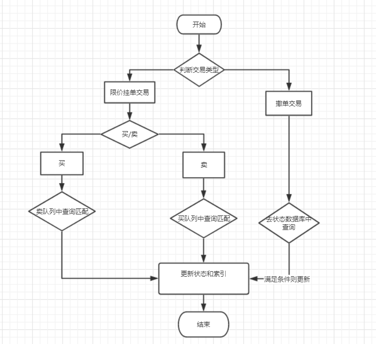

# 基于chain33开发的去中心化交易所合约

## 背景

  目前chain33官方plugin下面已经有类似的去中心化交易合约trade,但是在实际使用的过程中存在诸多问题。
  
  序号|问题
  ---|---
  1|根据挂单号买卖，不能自动撮合交易
  2| rpc查询接口,不全，不能仅根据交易对信息，获取挂单列表，需要额外的数据库去支持，繁琐
  3|构建的交易参数众多，不太好用
  
  
## 需求分析
  
  需要新构建一个新的合约，解决如上问题，实现类似如传统中心化交易所那样的便捷性
  
  序号|难点
  ---|---
  1|交易数据模型制定
  2|账户状态切换
  3|多方位的查询接口，交易对，市场深度，单号查询等
  4|利用levelDB中list功能，设计先进先出的队列

## 查询接口

 1. 提供指定交易对的市场深度查询
 
 2. 提供指定交易对挂单查询(系统内部使用）
 
 3. 提供根据挂单状态查询用户自己最新的挂单信息

 4. 查询最新已经成交的挂单信息
 
 
 ## 关键点
 
  1. 出于系统安全设计，系统设置了最大撮合深度，最大可撮合9999已有的挂单，但是执行过程中代码中做了限制，目前是设置100单，
  防止撮合的交易过多，导致产生的k,v数量剧增，产生的回执日志过大。
  
  2. 挂单价格取值范围做了限制(0,1e7),精度到小数点后7位，与系统精度保持一致
  
  3. 目前支持只limitOder限价挂单和revokeOrder 撤回挂单的交易， marketOrder市场挂单存在风险，暂时不支持

## 存储模型设计

 ```
// action 设计
 message ExchangeAction {
    oneof value {
        //限价挂单
        LimitOrder limitOrder = 1;
        //市场挂单
        MarketOrder marketOrder = 2;
        //撤回挂单
        RevokeOrder revokeOrder = 3;
    }
    int32 ty = 6;
}
//限价订单
message LimitOrder {
    //交易对
    asset leftAsset  = 1;
    //交易对
    asset rightAsset  = 2;
    //价格
    float price  = 3;
    //总量
    int64 amount = 4;
    //操作， 1为买，2为卖
    int32 op = 5;
}

 //市价委托
message MarketOrder {
    //资产1
    asset leftAsset  = 1;
    //资产2
    asset rightAsset = 2;
    //总量
    int64 amount = 3;
    //操作， 1为买，2为卖
    int32 op = 4;
}

 //撤回订单
message RevokeOrder {
    //订单号
    string orderID   = 1;
}
//资产类型
message asset {
    string execer = 1;
    string symbol = 2;
}

 //订单信息
message Order {
    string orderID   = 1;
    oneof value {
        LimitOrder limitOrder = 2;
        MarketOrder marketOrder = 3;
    }
    //挂单类型
    int32 ty = 4;
    //已经成交的数量
    int64 executed = 5;
    //余额
    int64  balance = 6;
    //状态,0 挂单中ordered， 1 完成completed， 2撤回 revoked
    int32 status = 7;
    //用户地址
    string addr = 8;
    //更新时间
    int64 updateTime = 9;
    //索引
    int64 index = 10;
}

 //挂单价
message OrderPrice {
    float price  = 1;
    int64  index = 2;
}
//单号
message OrderID {
    string ID   = 1;
    int64  index = 2;
}
//查询接口
message QueryMarketDepth {
    //资产1
    asset leftAsset  = 1;
    //资产2
    asset rightAsset = 2;
    //操作， 1为买，2为卖
    int32 op = 3;
    // 这里用价格作为索引值
    float price  = 4;
    //单页返回多少条记录，默认返回10条,为了系统安全最多单次只能返回20条
    int32 count = 5;
}
//市场深度
message MarketDepth {
    //资产1
    asset leftAsset  = 1;
    //资产2
    asset rightAsset = 2;
    //价格
    float price  = 3;
    //总量
    int64 amount = 4;
    //操作， 1为买，2为卖
    int32 op = 5;
}
//查询接口返回的市场深度列表
message MarketDepthList {
    repeated MarketDepth list = 1;
}

 //查询最新得成交信息,外部接口
message QueryCompletedOrderList {
    //资产1
    asset leftAsset  = 1;
    //资产2
    asset rightAsset = 2;
    // 索引值
    int64 index = 3;
    //单页返回多少条记录，默认返回10条,为了系统安全最多单次只能返回20条
    int32 count = 4;
    // 0降序，1升序，默认降序
    int32 direction = 5;
}

 //根据orderID去查询订单信息
message QueryOrder {
    string orderID   = 1;
}
//根据地址，状态查询用户自己的挂单信息
message QueryOrderList {
    //挂单状态必填(默认是0,只查询ordered挂单中的)
    int32 status = 1;
    //用户地址信息，必填
    string address = 2;
    // 索引值
    int64 index = 3;
    //单页返回多少条记录，默认返回10条,为了系统安全最多单次只能返回20条
    int32 count = 4;
    // 0降序，1升序，默认降序
    int32 direction = 5;
}
//订单列表
message OrderList {
    repeated Order list = 1;
}


 //exchange执行票据日志
message ReceiptExchange {
    Order order = 1;
    repeated Order matchOrders = 2;
    int64  index      = 3;
}
 ```
 [具体proto文件](https://github.com/harrylee2015/plugin/blob/exchange/plugin/dapp/exchange/proto/exchange.proto)

## 索引设计

 
 
 |键|值|用途|说明|
|-|-|-|-|
|LODB-exchange-depth-{leftAsset}-{rightAsset}-{op}:{price}|资产交易对买/卖的深度|给用户提供查询，用于实时查询市场深度|变参为leftAsset，rightAsset，op (1为买，2为卖),价格(%0016 占16位,根据价格进行计算得来)|
|LODB-exchange-order-{leftAsset}-{rightAsset}-{op}:{price}:{index}|挂单ID和index|记录具体的挂单orderID和index|变参为leftAsset，rightAsset，op (1为买，2为卖),价格,和index(%022d 比系统原有的多占了四位用于撮合时,根据顺序来区分和设置唯一的key)|
|LODB-exchange-completed-{leftAsset}-{rightAsset}-{index}|挂单ID和index|记录已经成交挂单的orderID和最新index|变参为leftAsset，rightAsset，op index(%022d 多了四位用于撮合时,根据顺序来区分和设置唯一的key)|
|LODB-exchange-addr:{addr}:{status}:{index}|挂单ID和index|根据地址和状态记录挂单的orderID和index，用于用户根据挂单状态自己地址下面的挂单详情|变参为addr，status(0 ordered,1 completd,2 revoked)，index (%022d 比系统原有的多占了四位用于撮合时,根据顺序来区分和设置唯一的key)|
|mavl-exchange-orderID:{orderID}|挂单信息|存在状态数据库中，任何人都可以根据具体orderID来查询具体的挂单信息|变参为orderID(也就是交易的txhash)|

[合约代码中的具体实现](https://github.com/harrylee2015/plugin/blob/exchange/plugin/dapp/exchange/executor/kv.go)


## 查询接口设计

和proto文件中展示的那样，这里就略过

[代码中的实现](https://github.com/harrylee2015/plugin/blob/exchange/plugin/dapp/exchange/executor/query.go)

 


## exchange合约执行流程



